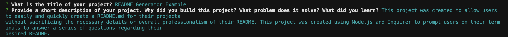
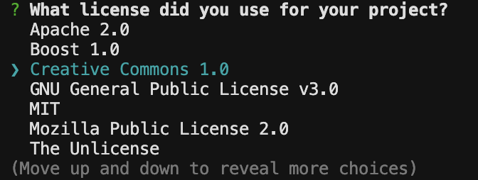
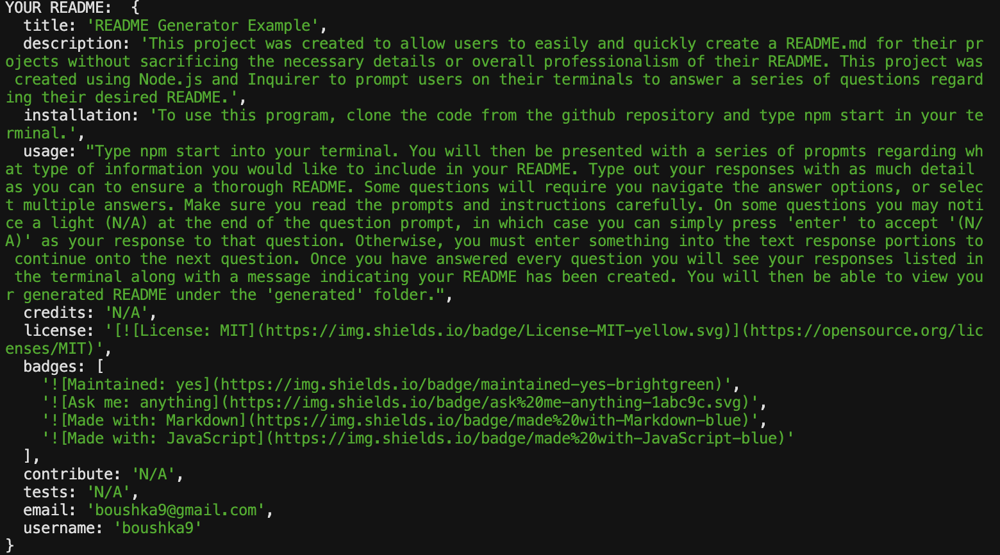
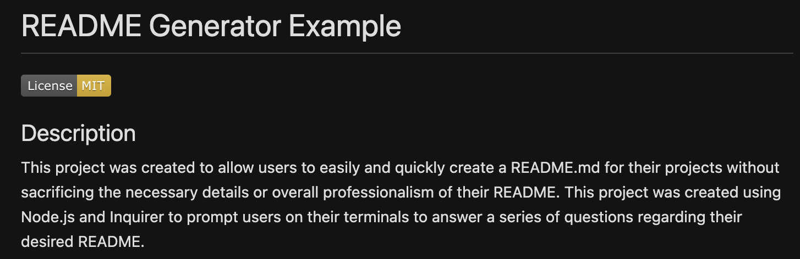

# Professional README Generator

  

  ## Description

  This project was created to allow users to easily and quickly create a README.md for their projects without sacrificing the necessary details or overall professionalism of their README. This project was created using Node.js and Inquirer to prompt users in their terminals to answer a series of questions regarding their desired README. The questions prompt users for the title of their project and information for the Description, Installation, Usage, License, Contributing, Tests, and Questions sections of their README. The project was made using Node.js and modules fs, inquirer, and util.

  ## Table of Contents

  - [Installation](#installation)
  - [Usage](#usage)
  - [Credits](#credits)
  - [License](#license)

  ## Installation

  To use this program, clone the code from https://github.com/boushka9/touch-README and type 'npm start' in your terminal to run.

  ## Usage
  
  Walkthrough video: https://drive.google.com/file/d/1lao4Z-lG3Am8jpxK1WRy-Zhodfl5eBp1/view?usp=sharing

  Type npm start into your terminal. You will then be presented with a series of propmts regarding what type of information you would like to include in your README. Type out your responses with as much detail as you can to ensure a thorough README, and click enter to view the next question. 

  

  Some questions will require you navigate the answer options, or select multiple answers. Make sure you read the prompts and instructions carefully. 
  
  

  On some questions you may notice '(N/A)' at the end of the question prompt, in which case you can simply press 'enter' to accept '(N/A)' as your response to that question. Otherwise, you must enter something into the text response portions to continue onto the next question. 
  
  Once you have answered every question you will see your responses listed in the terminal along with a message indicating your README has been created.
  
  
  
  You will then be able to view your generated README under the 'generated' folder.

  
 

  ## Credits

  https://www.youtube.com/watch?v=Qf5EXOyGRxw&ab_channel=Markodex

  https://gist.github.com/Amitabh-K/ae073eea3d5207efaddffde19b1618e8

  https://gist.github.com/lukas-h/2a5d00690736b4c3a7ba

  ## License

  This project is licensed under the terms of the MIT license 

  ---

  ## Badges

        

  ## How to Contribute

  N/A

  ## Tests

  N/A

  ## Questions

  If you have any questions regarding this application, you can contact me at:

  boushka9@gmail.com

  Or via GitHub:

  boushka9

  

